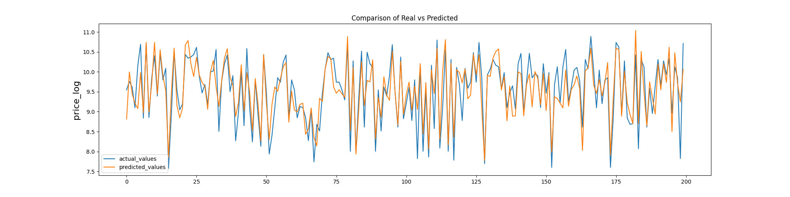
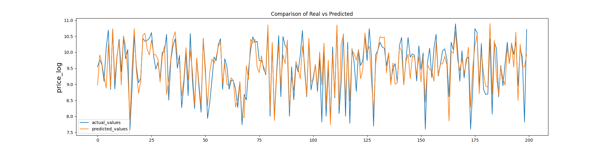
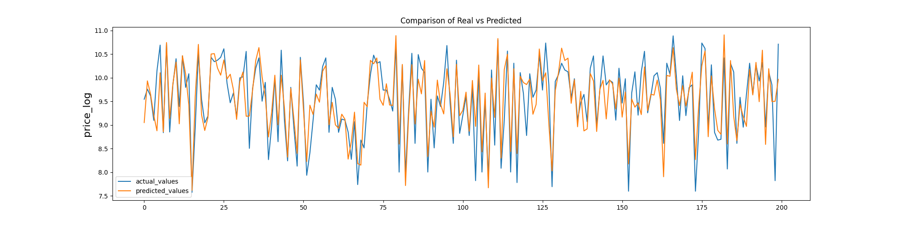
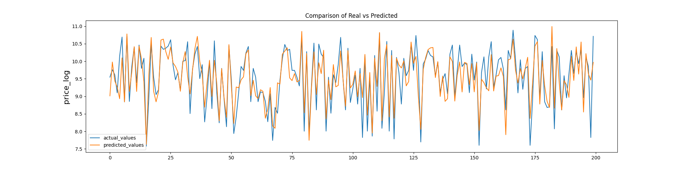
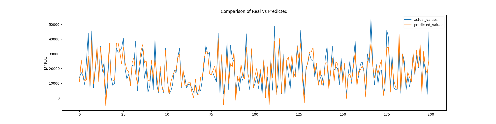
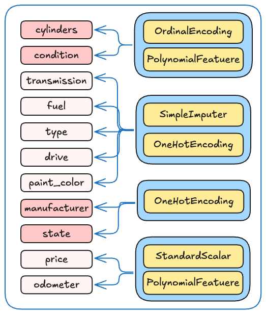

# What drives the price of a car?

### Problem statement

The provided dataset contains information on 426K cars to ensure speed of processing. The goal is to understand what factors make a car more or less expensive. As a result of your analysis, you should provide clear recommendations to your client -- a used car dealership -- as to what consumers value in a used car.


# Preparation (Enrichment / Backfill)

It was noticed a majority of data was missing, thus building a meaningful model may be challanging. We wanted to collect as much data as possible to make more meaningful prediction. 

**DataSet statistics**

```bash
manufacturer     4.133714
model            1.236179
condition       40.785232
cylinders       41.622470
fuel             0.705819
transmission     0.598763
drive           30.586347
size            71.767476
type            21.752717
```

It was noticed that VIN Number shared was actual VIN number and it roghtly mapped to Car's details when checked for random sample.  Reference `https://vpic.nhtsa.dot.gov`

Thus an ETL Job was written to fetch the details of all Cars whose VIN was provided to run on Google Cloud's Dataflow to fetch details of all VIN

**Script Reference**: [etl\enrich_vehicle.py](etl\enrich_vehicle.py)

**To Run the script** 

```bash	
python -m enrich_vehicle.py \
--input datavehicles.csv \
--output practical-application-module-11/practical_application_II_starter/data/vehicles_output \
--runner DirectRunner
```

#### Data Enrichment [01_enrich.ipynb](01_enrich.ipynb) 

This is the file used to enrich the vehicle already given data with enriched data. 

- We were able to fetch data on 113786 unique vehicles from the list of 426K data provided.
  - `drive` information was added for `14416`  missing vehicles
  - `type` was backfilled for `77176` vehicles missing information
  - `cylinder` data was identified for `89942` missing data.
  - Similarly `transmission` , `fuel` and `manufacturer`  `303`, `2109` and `2885`  missing respectively.
- Only the data which matched to already existing unique value of columns were picked and no new values were introduced. 
- Static Values were only picked up like, `manufacturer`, `condition`, `cylinders`, `fuel`, `transmission` and `drive`
- The output of which was persised in `data/vehicles_v2.csv`. 

Below is the stats after enrichment

```bash 
manufacturer     3.33
model            1.26
condition       38.11
cylinders       16.41
fuel             0.10
transmission     0.48
VIN             38.60
drive           26.46
size            71.46
type            15.90
```

Seeing above data we see significant improvement in reduction of  `na` in dataset.

# Approach


The whole Expercise was split in to multiple sub sections

### Cleaning

**Reference for Cleaning and EDA**.: [02_prompt_II.ipynb](02_prompt_II.ipynb) and [03_profiling.ipynb](03_profiling.ipynb)


- After dropping column `VIN` we had `29649` unique model. Feature, `model` is a free text with almost 30K unique values. This will not be contributing to modeling. Thus the column `model` was dropped too.
- `1171` duplicates were dropped
- There were `75` columns with missing `manufacturer`, `condition`, `cylinders`, `fuel` and `transmission`which were dropped
- There were `2425` columns with missing `manufacturer`, `condition`, `cylinders`, `drive` and `type` which were also dropped 
- Cosmetric Changes were done as follows
  - `state`, `region`and `manufacturer` were uniformly modified o have TitleCase

### EDA 


- `25199` records which is `6.86%` of all data had `price` less then equal to 0. Similarly `1582`which is `0.43%` had `odometer` less then equal to 0. All these idenified records were dropped.
- Additionally there were `1901` records which had `price` and `odometer` less than 1000, we will not be considering those records.
- Outliers were removed by individually using `IQR` for `price` and `odometer` which removed approx `21644` (`~7%`)  records.
- Pattern of Price and Odometer were as follows 


- Each of the parameters were individually analyzed to see thr pattern and distribution

| Diagram                                                      |                                                         |
| ------------------------------------------------------------ | ------------------------------------------------------- |
|  |  |
|         |          |
|    |      |
|  |  |
|         |          |
|        |         |
|  |   |

- The Output of EDA is persisted in `vehicles_v3.csv`.

### Preprocessing


- Data that were dropped from analysis were `VIN`, `model`, `title_status`, `size`, `region`
- Cosmetric Changes were done as follows
  - `state`, `region`and `manufacturer` were uniformly modified to have TitleCase


# Models

### Model 1

File Reference [04_model_1.ipynb](04_model_1.ipynb) 

##### Transformation + Linear Regression

#### Steps


```bash
* SimpleImputer and then OneHotEncoder on 'transmission','fuel', 'type', 'drive', 'paint_color'
* Plain OneHotEncoder on 'manufacturer','state'
* OrdinalEncoder on 'condition' and 'cylinders'
* StandardScaler and the PolynomialFeatures on 'year', 'odometer'
```

#### Line Plot of 200 Sample points



---

### Model 2

File Reference [05_model_2_3.ipynb](05_model_2_3.ipynb) 

##### Transformation + PolynomialFeature (all fields) + Linear Regression

```bash
1. Transformation    
* SimpleImputer -> OneHotEncoder on 'transmission','fuel', 'type', 'drive', 'paint_color' 
* Plain OneHotEncoder on 'manufacturer','state'
* OrdinalEncoder on 'condition' and 'cylinders' 
* StandardScaler and the PolynomialFeatures on 'year', 'odometer'
2. Apply PolynomialFeatures(degree=2) on all the transformed fields    
3. LinearRegression
```


---

### Model 3

File Reference [05_model_2_3.ipynb](05_model_2_3.ipynb) 

##### Transformation + PolynomialFeature (4 fields) + Linear Regression

```bash
1. Transformation    
* SimpleImputer -> OneHotEncoder on 'transmission','fuel', 'type', 'drive', 'paint_color' 
* Plain OneHotEncoder on 'manufacturer','state'
* OrdinalEncoder -> PolynomialFeatures (degree=2) on 'condition' and 'cylinders' in respective parallel   
  pipeline
* StandardScaler and the PolynomialFeatures on 'year', 'odometer'
2. LinearRegression
```


---

### Model 4

File Reference [06_model_4_5_6.ipynb](06_model_4_5_6.ipynb)

##### Transformation + PolynomialFeature (4 fields) + SequentialFeatureSelector (15 features) + Linear Regression

```bash
1. ColumnTransformation<br>
- OrdinalEncoder > PolynomialFeature (degree=2) on 'cylinders' and 'condition' on separate pipelines 
- SimpleImputer > OneHotEncoder on 'transmission','fuel', 'type', 'drive', 'paint_color' in a pipeline
- StandardScaler > PolynomialFeatures (degree=2) on ['year', 'odometer']           
2. SequentialFeatureSelector (n_features_to_select=15)
3. LinearRegression
```



---

### Model 5

File Reference [06_model_4_5_6.ipynb](06_model_4_5_6.ipynb)

##### Transformation + PolynomialFeature (4 fields) + SequentialFeatureSelector (20 features) + Linear Regression

```
1. ColumnTransformation<br>
- OrdinalEncoder > PolynomialFeature (degree=2) on 'cylinders' and 'condition' on separate pipelines 
- SimpleImputer > OneHotEncoder on 'transmission','fuel', 'type', 'drive', 'paint_color' in a pipeline
- StandardScaler > PolynomialFeatures (degree=2) on ['year', 'odometer']           
2. SequentialFeatureSelector (n_features_to_select=20)
3. LinearRegression
```



---

###  Model 6 

File Reference [06_model_4_5_6.ipynb](06_model_4_5_6.ipynb)

#####  Transformation + PolynomialFeature (4 fields) + SequentialFeatureSelector (30 features) + Linear Regression

```bash
1. ColumnTransformation<br>
- OrdinalEncoder > PolynomialFeature (degree=2) on 'cylinders' and 'condition' on separate pipelines 
- SimpleImputer > OneHotEncoder on 'transmission','fuel', 'type', 'drive', 'paint_color' in a pipeline
- StandardScaler > PolynomialFeatures (degree=2) on ['year', 'odometer']           
2. SequentialFeatureSelector (n_features_to_select=30)
3. LinearRegression
```



---

### Model 7

File Reference [07_model_7_8_9.ipynb](07_model_7_8_9.ipynb)

##### Transformation + PolynomialFeature (4 fields) + SelectFromModel(Lasso) + Linear Regression

```bash
1. ColumnTransformation<br>
- OrdinalEncoder > PolynomialFeature (degree=2) on 'cylinders' and 'condition' on separate pipelines 
- SimpleImputer > OneHotEncoder on 'transmission','fuel', 'type', 'drive', 'paint_color' in a pipeline
- StandardScaler > PolynomialFeatures (degree=2) on ['year', 'odometer']           
2. SelectFromModel(Lasso)
3. LinearRegression
```


---

### Model 8

File Reference [07_model_7_8_9.ipynb](07_model_7_8_9.ipynb)

##### Transformation + PolynomialFeature (4 fields) + Lasso


### Model 9

File Reference [07_model_7_8_9.ipynb](07_model_7_8_9.ipynb)

##### Transformation + PolynomialFeature (4 fields) + SelectFromModel(Lasso(), max_features=75) + Linear Regression



### Model 10

File Reference [08_model_10_11.ipynb](08_model_10_11.ipynb)

##### Transformation + PolynomialFeature (4 fields) + Ridge (default alpha)


### Model 11

File Reference [08_model_10_11.ipynb](08_model_10_11.ipynb)

##### Transformation + PolynomialFeature (4 fields) + Ridge (alpha=10)


---

# Evaluation

### Comparision of Models

Each and every had gone ColumnTransfromation, Standard Scalar and Model was applied. MSE and R<sup>2</sup> were tablulated. as below.

| Model | Description                                                  | Training MSE       | Test MSE           | R-Square |
| ----- | ------------------------------------------------------------ | ------------------ | ------------------ | -------- |
| 1     | Transformation + Linear Regression                           | 38181229.52403128  | 38075772.29807217  | 0.7554   |
| 2     | Transformation + <br>PolynomialFeature (all fields) + <br>Linear Regression | 23762515.4827903   | 24927248.450849023 | 0.8409   |
| 3     | Transformation + <br/>PolynomialFeature (4 fields) + <br/>Linear Regression | 35454226.46229427  | 35323206.23269257  | 0.7746   |
| 4     | Transformation + <br/>PolynomialFeature (4 fields) + <br/>SequentialFeatureSelector (15 features)<br>Linear Regression | 40621101.505078465 | 40581119.91222496  | 0.7411   |
| 5     | Transformation + <br/>PolynomialFeature (4 fields) + <br/>SequentialFeatureSelector (20 features)<br/>Linear Regression | 39202495.23184522  | 39090014.52399856  | 0.7506   |
| 6     | Transformation + <br/>PolynomialFeature (4 fields) + <br/>SequentialFeatureSelector (30 features)<br/>Linear Regression | 37303420.38294286  | 37126532.58778653  | 07631    |
| 7     | Transformation + <br/>PolynomialFeature (4 fields) + <br/>SelectFromModel(Lasso())<br/>Linear Regression | 35465551.2312093   | 35327202.025824144 | 0.7746   |
| 8     | Transformation + <br/>PolynomialFeature (4 fields) + <br/>Lasso (20 features) | 35481125.61269196  | 35351191.26094681  | 0.7744   |
| 9     | Transformation + <br/>PolynomialFeature (4 fields) + <br/>SelectFromModel(Lasso(), max_features=75)<br/>Linear Regression | 35864312.200730674 | 35748186.65240281  | 0.7719   |
| 10    | Transformation + <br/>PolynomialFeature (4 fields) + <br/>Ridge (Default alpha) | 35454726.4658569   | 35324613.363171615 | 0.7746   |
| 11    | Transformation + <br/>PolynomialFeature (4 fields) + <br/>Ridge (alpha=8.11) | 35461886.65282253  | 35327803.886383526 | 0.7746   |


# Summary 

**Model 1**: Simplest to implement. PolynomialFeature is applied to 2 of the most relevent and high dependent variables - Price and Odometer. There are quiet a few nonnumeric, categorial data like `transmission`, `fuel`, `type`, `drive`,  `paint_color`, `state` and `manufacturer` on which we have applied OneHotEncodoing is applied. out of which on 1st 5 fields a SimpleImputer is used to assume all `null` as `other`. Inividual OrdinalEncoder was used for `cylinders` and `condition`. StandardScaler on `year` and `odometer`

We had predetermined using loop, the best degree to be used is seen at 2. 

**Con**: The MSE was a bit on higher end as compared with few others. 

---

**Model 2**: Is an enhancement of above model. The only change is we had Applied PolynomialFeature (degree=2) on all the fields 10 after transforming as in above.

**Con** : There were **9179** total features in model which is quiet heavy. Also fitting this model took considerable time.

**Pro**:  The MSE was the least of all the tried out models. If we desire more accurate prediction result, we can still use this model. 

---

**Model 3**: This model is mod way between the Model 1 and Model 2. The transformation is same, but the PolynomialFeature (degree=2) was applied on 4 fields. `cylinders`, `condition`, `year` and `odometer` .OneHotEncodoing was applied on rest 7 nonnumeric categorial data. StandardScaler on `year` and `odometer` 

**Pro**: This gave a better results than **Model 1****, but the model was on 139 features only as compared to 9K+ as in Model 2. The fiting and prediction is must faster than Model 2.

**Con**: Has more MSE as compared to **Model 2**. 

---

Column Transform for all modules below is kept same as below



**Model 4, 5 ,6**. In attempt to narrow down the to key features which controbute to the model fitting, The Transformation and PolynomialFeature was kept as it is but `SequentialFeatureSelector` was used to pick 15, 20 and 30 features in Model 4, 5 and 6 respectively. 

-  With increasing number of features, the MSE kept decreasing and at 30 features, it was down below **Model 1**
- If we had selected more features, MSE would have leveled up with **Model 3** but with less number of features.

---

**Model 7, 8, 9** These 3 models are based on `SelectFromModel` and `Lasso` model. The difference being **Model 7**, was using feature selection (`SelectFromModel`) using `Lasso` Model without specifying the number of features. **Model 8** is using plain `Lasso` Model and **Model 9** is variation of Model 7, with difference that we have specified number of features to select. The Transformation of all features  was kepy same is in Model 4,5,and 6

-  The MSE was at same level as Model 2 for all 3 Models, there was no significant improvement or degrade of MSE.

**Con**: Fitting was taking the longest possible time as compared to all other models

---

**Model 10, 11** These 2 models are based on `Ridge` model. **Model 10** was using the default alpha and for Model 11, Optimum value of `alpha` was determined to be 10 using **GridSearchCV**. The performance is must better than Lasso Models. 

-  MSE were again same as Model 2, 7, 8 and 9

---

# Conclusion

- The best model with lowest MSE is Applying PolynimialFeature (degree=2) on all features. Unfortunately its a very expensive model with over 9179+ features. 
- There is a recommenndation to either use `Model 2`, applying PolynimialFeature (degree=2)  on 4 features ('year', 'odometer', cylinder, 'condition') As it considers polynomialFeatures for some key numeric features and uses OrdinalEncoding, OneHotEncoding on other features..
- `Model 10` or `Model 11` using `Ridge` model which is an alternate model to above which considers every feature and gives right penalty to some features.


